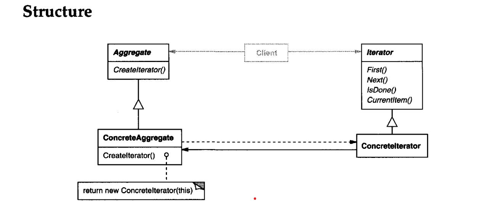

Intent
---------
*Provide a way to access the elements of an aggregate object sequentially without
exposing its underlying representation.*

1. The key idea in this pattern is to take the responsibility for access and traversal out of the list object 
and put it into an iterator object. 
2. The Iterator class defines an interface for accessing the list's elements. An iterator object is responsible
for keeping track of the current element; that is, it knows which elements have been traversed already.

Overall, the Iterator design pattern is a useful tool for encapsulating the logic for accessing elements of a collection, making it easier to write code that works with a variety of different collections in a uniform manner.