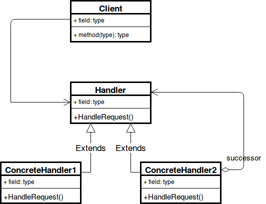

Intent:
---------
Chain of Responsibility is a behavioral design pattern that lets you pass requests along a chain of handlers. 
Upon receiving a request, each handler decides either to process the request or to pass it to the next handler
in the chain

the Chain of Responsibility relies on transforming particular behaviors into stand-alone objects called **handlers**. 

Advantages of Chain of Responsibility
------------------------------------
1. Reduced coupling
2. Added flexibility in assigning responsibilities to objects
3. Receipt isn't guaranteed 

Disadvantages
--------------
1. Mostly, it can get broken easily:
    if a processor fails to call the next processor, the command gets dropped
    if a processor calls the wrong processor, it can lead to a cycle
2. It can create deep stack traces, which can affect performance
3. It can lead to duplicate code across processors, increasing maintenance

RealWorld
1. DoFilter
2. Logger

