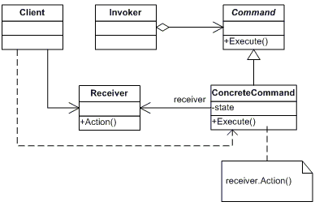
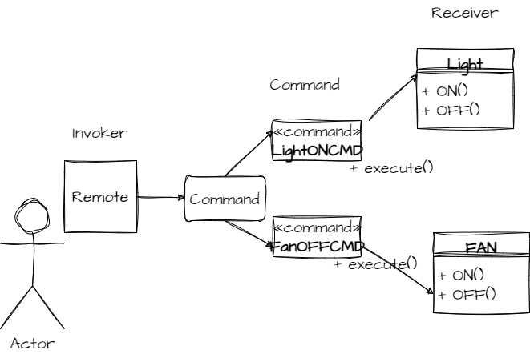

**Intent**
-
*Encapsulate a request as an object, thereby letting you parameterize clients with
different requests, queue or log requests, and support undoable operations.*

Also, Known As - `Action, Transaction`

**Applicability**
-

Use the Command pattern when you want to
1. parameterize objects by an action to perform, as MenuItem objects.
2. specify, queue, and execute requests at different times. A Command object
can have a lifetime independent of the original request. If the receiver of a
request can be represented in an address space-independent way, then you
can transfer a command object for the request to a different process and fulfill
the request there.
3. support undo. TheCommand's Execute operation can store state for reversing its effects in the command itself. The Command interface must have an
added un-execute operation that reverses the effects of a previous call to execute. Executed commands are stored in a history list. Unlimited-level undo
and redo is achieved by traversing this list backwards and forwards calling
un-execute and Execute,respectively.
4. support logging changes so that they can be reapplied in case of a system
crash. By augmenting the Command interface with load and store operations, you can keep a persistent log of changes. Recovering from a crash
involves reloading logged commands from disk and re-executing them with
the Execute operation.
5. structure a system around high-level operations built on primitives operations. Such a structure is common in information systems that support transactions. A transaction encapsulates a set of changes to data. The Command
pattern offers a way to model transactions. Commands have a common interface, letting you invoke all transactions the same way. The pattern also
makes it easy to extend the system with new transactions.
