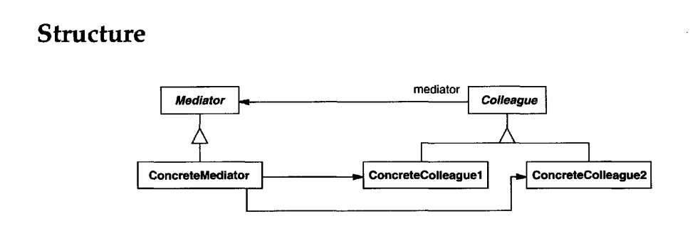
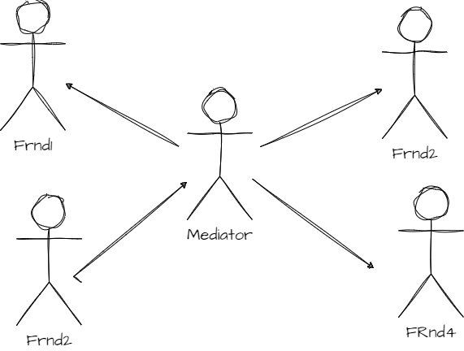

Intent
----------
Define an object that encapsulates how a set of objects interact. Mediator promotes
loose coupling by keeping objects from referring to each other explicitly, and it
lets you vary their interaction independently.

**Example:**
---------
Dialog Box
-----------
1. Often there are dependencies between the widgets in the dialog. For example,
a button gets disabled when a certain entry field is empty. Selecting an entry
in a list of choices called a list box might change the contents of an entry field.
Conversely, typing text into the entry field might automatically select one or more
corresponding entries in the list box. Once text appears in the entry field, other
buttons may become enabled that let the user do something with the text,such as
changing or deleting the thing to which it refers.

2. Different dialog boxes will have different dependencies between widgets. So even 
though dialogs display the same kinds of widgets, they can't simply reuse stock
widget classes; they have to be customized to reflect dialog-specific dependencies.
Customizing them individually by subclassing will be tedious, since many classes
are involved

3. You can avoid these problems by encapsulating collective behavior in a separate
mediator object

------------------------------------------------------------------------
A **mediator** is responsible for controlling and coordinating the
_interactions_ of a group of objects. The mediator serves as an intermediary that
keeps objects in the group from referring to each other explicitly. The objects only
know the mediator, thereby _reducing the number of interconnections_.

**_Use of Mediator Pattern_**

The Mediator Pattern is a good choice if we have to deal with a set of objects that are tightly coupled and hard to maintain.
This way we can reduce the dependencies between objects and decrease the overall complexity.

Additionally, by using the mediator object, we extract the communication logic to the single component,
therefore we follow the _Single Responsibility Principle_. Furthermore, we can introduce new mediators with 
no need to change the remaining parts of the system. Hence, we follow the _Open-Closed Principle_.

****Consequences****

1. It limits subclassing
2. decouples colleagues
3. simplifies object protocols
4. abstracts how objects cooperate
5. centralizes control

