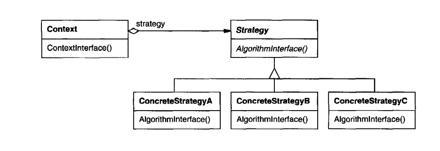

Intent
--------
Define a family of algorithms, encapsulate each one, and make them interchangeable.
Strategy lets the algorithm vary independently of clients that use it.

Uses
1. In Machine Learning after many models deployed with different algorithms next this is to test the models'
   efficiency from user data. So here with strategy pattern we can test different models for each set of users.
   client code has complete control over deciding what can be called.
2. During Festival season a company can offer discount program like 50% Discount, Easter Bonanza, Festival offer
    we can avail different offers based on eve.
3. Another way we can call this as policy depending on the customer data either we can Parse as Plain text or Json
   or HTML etc.

Class Diagram

