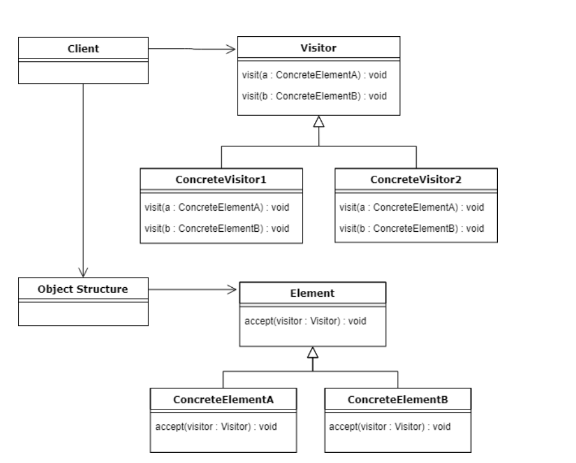
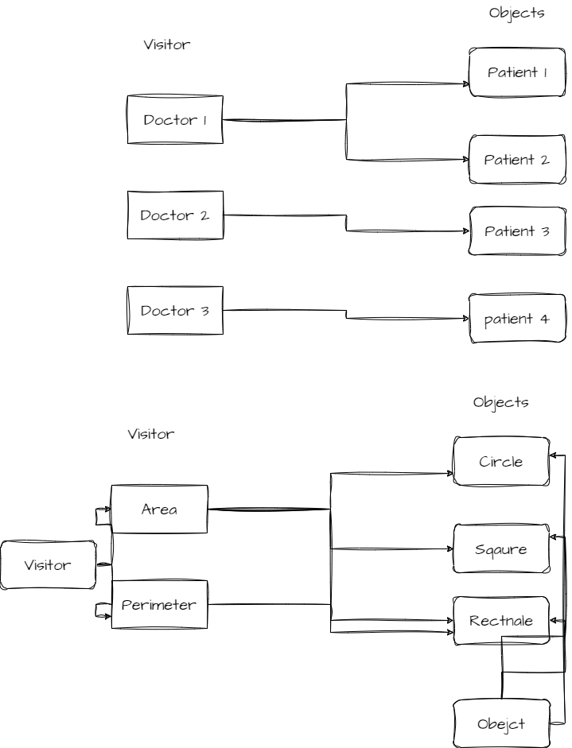

INTENT
----------

*The purpose of a Visitor pattern is to define a new operation without introducing the modifications to an existing object structure.*

used to decouple the logic/algorithm from the objects on which they operate. The logic is moved to separate classes called visitors.

Each visitor is responsible for performing a specific operation.

Explanation

