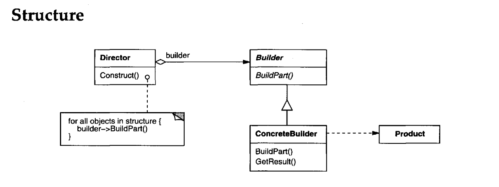

**Intent**
-----------
Separate the construction of a complex object from its representation so that the
same construction process can create different representations.

**Usage examples**
--------------------
* The Builder pattern is a well-known pattern in Java world.
* It’s especially useful when you need to create an object with lots of possible configuration options.

_There are three major issues with Factory and Abstract Factory design patterns when the Object contains a lot of attributes._

1. Too Many arguments to pass from client program to the Factory class that can be error prone because most of the time, the type of arguments are same and from client side its hard to maintain the order of the argument.
2. Some parameters might be optional but in Factory pattern, we are forced to send all the parameters and optional parameters need to send as NULL.
3. If the object is heavy and its creation is complex, then all that complexity will be part of Factory classes that is confusing.

*We can solve the issues with large number of parameters by providing a constructor with required parameters and then different setter methods to set the optional parameters.*
*The problem with this approach is that the Object state will be inconsistent until unless all the attributes are set explicitly.*

*Builder pattern solves the issue with large number of optional parameters and inconsistent state by providing
a way to build the object step-by-step and provide a method that will actually return the final Object*

**Important Considerations**
1. When we have too many optional fields
2. A different way of defining object immutability
3. When we want restriction over fields access hierarchy

**Here I am talking about Implementing**
1. User Builder ( have required and optional fields)
2. Car Builder (Normal Builder and Priority Fields Builder)