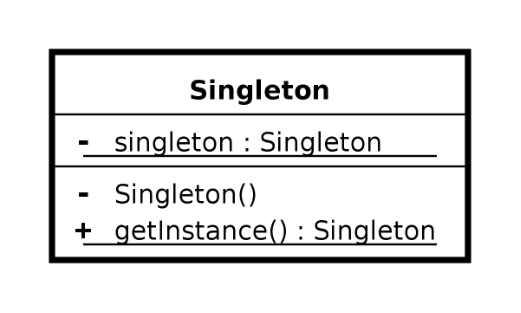

**Intent**
----------
Ensure a class only has one instance, and provide a global point of access to it.

Types
-----
1. Normal Singleton
2. Eager Singleton
3. Double Lock Singleton
4. Bill Push Singleton
5. Static Block Singleton
6. Enum Based Singleton

most commonly used design pattern 

Applications 
1. when managing access to a resource which is shared by the entire application
2. Singleton pattern is used for logging, drivers objects, caching, and thread pool
3. **Real World Example** : sharing a single washing machine among all the residents in a hotel or sharing a single appliance like refrigerator among all the family members