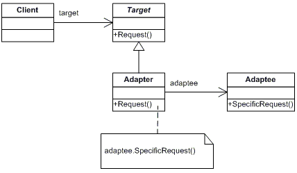

**Intent**
------
*Adapter is a behavioral design pattern that allows objects with incompatible interfaces to collaborate.*

*Here I am Implementing Adaptor to call vendor api's from client. Where vendor accepts request as XML
and Client send request as JSON. both are incompatible we used adaptor in between to convert client JSON
to XML and call to Vendor API and take the response and return to Client incompatible*

**Adapters are two Types**
1. Object Adapter and
2. Class Adapter

In this example we used Object Adapter. To use Class Adapter we required Multiple Inheritance and java doesn't supports

Also using Class Adapter is violating principle of "Use composition Over Inheritance"

Try This.
---------
We have different data sources [JPA, Mongo, Cassandra, ...]

Try to create different repositories and without changing any client code. what ever data store client
wants your code should automatically support that without changing business logic and repository logic Changing

_Hint:_ Try To Use Adaptor and Factory Patterns

Will discuss when we do Project on Design Patterns