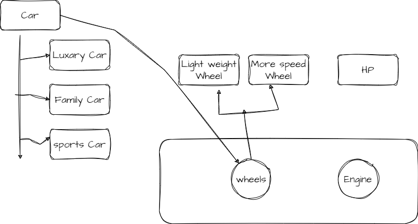

Intent
-------
Decouple an abstraction from its implementation so that the two can vary independently.

_This means to create a bridge interface that uses OOP principles to separate out responsibilities into different abstract classes._

**Another Example**

_Think of a car manufacturing company. The company wants to make both sports cars and family cars. Both types of cars have engines and wheels, but the way they are designed and the features they have are different. The company can use the Bridge Design Pattern to separate the engine and wheel components from the actual car design._

_So, the engine and wheel components are the abstractions, and the actual car design (sports car or family car) is the implementation. This way, the company can change the engine or wheel components independently without affecting the sports car or family car design and vice versa. This helps the company to be more flexible and adapt to changing market needs quickly._

**Applicability**
-------------------
Use the Bridge pattern when
* you want to avoid a permanent binding between an abstraction and its implementation. This might be the case,for example,when the implementation 
  must be selected or switched at run-time.
* Both the abstractions and their implementations should be extensible by
subclassing. In this case, the Bridge pattern lets you combine the different
abstractions and implementations and extend them independently.
* changes in the implementation of an abstraction should have no impact on
clients; that is, their code should not have to be recompiled