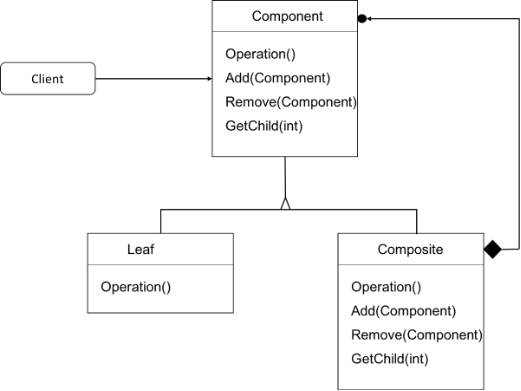

Intent
------
*Composite is a behavioral design pattern that lets you compose objects into tree structures and
then work with these structures as if they were individual objects.*

Simply its object made up of number of objects

Let's see the 4 elements of composite pattern.

1) **Component**
   Declares interface for objects in composition.
   Implements default behavior for the interface common to all classes as appropriate.
   Declares an interface for accessing and managing its child components.
2) **Leaf**
   Represents leaf objects in composition. A leaf has no children.
   Defines behavior for primitive objects in the composition.
3) **Composite**
   Defines behavior for components having children.
   Stores child component.
   Implements child related operations in the component interface.
4) **Client**
   Manipulates objects in the composition through the component interface.

Example Here:
------------
1. 
- Interface : Employee  
- Developer : Leaf
- Manager | ProductOwner | CEO : Composite [ contains many nodes ]
- Driver: Client 
2.
- Interface : Employee
- Employer : Leaf and Composite
- Driver: Client
