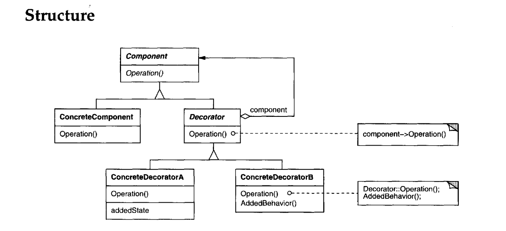

Intent
-----
*Attach additional responsibilities to an object dynamically. Decorators provide a
flexible alternative to subclassing for extending functionality*

Here we are implementing Car Decorator

_(How can we add functionality of a simple basic car to sports car, luxury car etc)_

